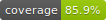
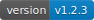
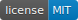
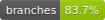

# badgepy

[](https://github.com/shenxianpeng/badgepy/actions/workflows/ci.yml)
[](https://codecov.io/gh/shenxianpeng/badgepy)
[](https://pypi.org/project/badgepy/)


> [!NOTE]
> **badgepy** is a fork of [google/pybadges](https://github.com/google/pybadges) with fixes including added support for Python 3.13 and 3.14, dropped Python 3.7/3.8 support, removal of deprecated `imghdr`, and replacement of `pkg_resources` and [many other fixes](https://github.com/shenxianpeng/badgepy/pulls?q=is%3Apr+is%3Aclosed). 
> This project is actively maintained.

badgepy is a Python library and command line tool that allows you to create GitHub-style badges as SVG images. It also provides a **local [shields.io](https://shields.io)-style badge generator** — generate badges from CI reports (JUnit, Cobertura), use preset recipes for build/coverage/version/license badges, and serve them via a Flask server, all without relying on external services.

The aesthetics of the generated badges matches the visual design found in this
[specification](https://github.com/badges/shields/blob/master/spec/SPECIFICATION.md).

The implementation of the library was heavily influenced by
[Shields.io](https://github.com/badges/shields) and the JavaScript
[badge-maker](https://github.com/badges/shields/tree/master/badge-maker#badge-maker) library.

## Getting Started

### Installing

`badgepy` can be installed using [pip](https://pypi.org/project/pip/):

```sh
pip install badgepy
```

To test that installation was successful, try:
```sh
python -m badgepy --left-text=build --right-text=failure --right-color='#c00' --browser
```

You will see a badge like this in your browser:


## Usage

badgepy can be used both from the command line and as a Python library.

The command line interface is a great way to experiment with the API before
writing Python code.

You could also look at the [example server](https://github.com/shenxianpeng/badgepy/tree/main/server-example).

### Command line usage

Complete documentation of badgepy command arguments can be found using the `--help`
flag:

```sh
badgepy --help
```

But the following usage demonstrates every interesting option:
```sh
badgepy \
    --left-text=complete \
    --right-text=example \
    --left-color=green \
    --right-color='#fb3' \
    --left-link=http://www.complete.com/ \
    --right-link=http://www.example.com \
    --logo='data:image/png;base64,iVBORw0KGgoAAAANSUhEUgAAAAIAAAACCAIAAAD91JpzAAAAD0lEQVQI12P4zwAD/xkYAA/+Af8iHnLUAAAAAElFTkSuQmCC' \
    --embed-logo \
    --whole-title="Badge Title" \
    --left-title="Left Title" \
    --right-title="Right Title" \
    --browser
```


#### A note about `--logo` and `--embed-logo`

Note that the `--logo` option can include a regular URL:

```sh
badgepy \
    --left-text="python" \
    --right-text="3.9, 3.10, 3.11, 3.12, 3.13, 3.14" \
    --whole-link="https://www.python.org/" \
    --browser \
    --logo='https://dev.w3.org/SVG/tools/svgweb/samples/svg-files/python.svg'
```


If the `--logo` option is set, the `--embed-logo` option can also be set.
The `--embed-logo` option causes the content of the URL provided in `--logo`
to be embedded in the badge rather than be referenced through a link.

The advantage of using this option is an extra HTTP request will not be required
to render the badge and that some browsers will not load image references at all.

 


#### A note about `--(whole|left|right)-title`

The `title` element is usually displayed as a
[pop-up by browsers](https://developer.mozilla.org/en-US/docs/Web/SVG/Element/title)
but is currently
[filtered by Github](https://github.com/github/markup/issues/1267).

### Library usage

badgepy is primarily meant to be used as a Python library.

```python
from badgepy import badge
s = badge(left_text='coverage', right_text='23%', right_color='red')
# s is a string that contains the badge data as an svg image.
print(s[:40]) # => <svg height="20" width="191.0" xmlns="ht
```

The keyword arguments to `badge()` are identical to the command flags names
described above except with keyword arguments using underscore instead of
hyphen/minus (e.g. `--left-text` => `left_text=`)

#### Server usage

badgepy can be used to serve badge images on the web.

[server-example](https://github.com/shenxianpeng/badgepy/tree/main/server-example)
contains an example of serving badge images from a
[Flask server](https://flask.palletsprojects.com/).

Start the example server with:

```sh
nox -s serve
```

Then open http://127.0.0.1:5000/ to view the badges.

### Preset Badges

badgepy includes preset recipes for common badge types with automatic color coding:

| Command | Preview |
| ------- | ------- |
| `badgepy preset build passing -o badges/build.svg` |  |
| `badgepy preset coverage 85.3 -o badges/coverage.svg` |  |
| `badgepy preset version v1.2.3 -o badges/version.svg` |  |
| `badgepy preset license MIT -o badges/license.svg` |  |
| `badgepy preset custom "linux" --label platform --color green -o badges/platform.svg` |  |

Or from Python:

```python
from badgepy.presets import build_badge, coverage_badge, custom_badge

svg = build_badge('passing')
svg = coverage_badge(85.3)
svg = custom_badge(label='platform', message='linux', color='green')
```

### CI Report Badges

Generate badges directly from CI test and coverage reports:

| Command | Preview |
| ------- | ------- |
| `badgepy from-junit tests/test-results.xml -o badges/tests.svg` |  |
| `badgepy from-coverage tests/coverage.xml --output-dir badges/` |   |

```sh
# From generic key-value or JSON files
badgepy from-generic metrics.json --output-dir badges/
```

Or from Python:

```python
from badgepy.parsers import badges_from_junit, badges_from_coverage

badges = badges_from_junit('tests/test-results.xml')   # {'tests': '<svg...>'}
badges = badges_from_coverage('tests/coverage.xml')    # {'coverage': '<svg...>', 'branch-coverage': '<svg...>'}
```

See [CI Integration Guide](docs/ci-integration.md) for GitHub Actions, GitLab CI, and Jenkins examples.

See [Shields.io Migration Guide](docs/shields-migration.md) to replace shields.io with badgepy.

### Output to File

Use `-o` / `--output` to write badges to a file instead of stdout:

```sh
badgepy --left-text=build --right-text=passing --right-color=green -o badges/build.svg
```

### Caveats

 - badgepy uses a pre-calculated table of text widths and
   [kerning](https://en.wikipedia.org/wiki/Kerning) distances
   (for western glyphs) to determine the size of the badge.
   So Eastern European languages may be rendered less well than
   Western European ones.

   

   and glyphs not present in Deja Vu Sans (the default font) may
   be rendered very poorly.

   

 - badgepy does not have any explicit support for languages that
   are written right-to-left (e.g. Arabic, Hebrew) and the displayed
   text direction may be incorrect.

   

## Development

```sh
git clone https://github.com/shenxianpeng/badgepy.git
cd badgepy
python -m venv venv
source venv/bin/activate
# Installs in editable mode with development dependencies.
pip install -e .[dev]
nox
```

If you'd like to contribute your changes back to badgepy, please read the
[contributor guide.](CONTRIBUTING.md)

## Versioning

We use [SemVer](http://semver.org/) for versioning.

## License

This project is licensed under the Apache License - see the [LICENSE](LICENSE) file for details.
