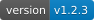

# badgepy

[](https://github.com/shenxianpeng/badgepy/actions/workflows/ci.yml)
[](https://codecov.io/gh/shenxianpeng/badgepy)
[](https://pypi.org/project/badgepy/)


> [!NOTE]
> **badgepy** is a fork of [google/pybadges](https://github.com/google/pybadges) with fixes including added support for Python 3.13 and 3.14, dropped Python 3.7/3.8 support, removal of deprecated `imghdr`, and replacement of `pkg_resources` and [many other fixes](https://github.com/shenxianpeng/badgepy/pulls?q=is%3Apr+is%3Aclosed). This project is actively maintained.

badgepy is a Python library and command-line tool for generating GitHub-style badges as SVG images — no external service required. Badges are rendered locally, offline, and fully under your control. It also provides a **local [shields.io](https://shields.io)-style badge generator** — generate badges from CI reports (JUnit, Cobertura), use preset recipes for build/coverage/version/license badges, and serve them via a Flask server, all without relying on external services.

The visual design follows the [Shields specification](https://github.com/badges/shields/blob/master/spec/SPECIFICATION.md) and is compatible with [Shields.io](https://shields.io).

## Shields.io vs badgepy

Both tools produce identical-looking badges, but they work very differently. Here's how to choose:

| | [Shields.io](https://shields.io) | badgepy |
|---|---|---|
| **How it works** | HTTP service — you request a badge URL and get back an SVG | Python library/CLI — generates SVGs locally |
| **Internet required** | Yes (or [self-host](https://github.com/badges/shields)) | No — works fully offline |
| **Setup** | Zero — just use a URL in your README | `pip install badgepy` |
| **Customization** | URL query parameters only | Full programmatic control in Python |
| **CI integration** | Via shields.io endpoint JSON | Native parsers for JUnit, Cobertura, generic JSON |
| **Rate limits** | Yes on shields.io (no limits if self-hosted) | None |
| **Preset badges** | Static badge only | build, coverage, version, license, custom, progress |
| **Output** | Rendered in browser from URL | SVG string, file, or served from your own app |

**Choose Shields.io if:**
- You just need a few badges in a README and don't want to install anything
- Your badge data is already exposed via a public API
- You're comfortable with the hosted service's availability and rate limits

**Choose badgepy if:**
- You're generating badges in a CI/CD pipeline and want offline reliability
- You need programmatic control over badge generation from Python
- You're parsing local test/coverage reports (JUnit, Cobertura) into badges
- You want to serve badges from your own application
- You need zero network dependencies at badge generation time

> 💡 **Already using Shields.io static badges?** See the [Shields.io Migration Guide](docs/shields-migration.md) for a drop-in replacement path.

## Sponsors

<p align="center">
  <a href="https://thanks.dev/r/canonical">
    
  </a>
</p>

badgepy is supported by [Canonical](https://canonical.com/) through
[thanks.dev](https://thanks.dev/r/canonical). Thank you, Canonical, for
supporting open source maintainers and helping make continued maintenance of
badgepy possible.

If your team depends on badgepy or wants to support independent open source
maintenance, please consider sponsoring the project through thanks.dev or
[GitHub Sponsors](https://github.com/sponsors/shenxianpeng).

## Getting Started

### Installing

```sh
pip install badgepy
```

Verify the installation:

```sh
python -m badgepy --left-text=build --right-text=failure --right-color='#c00' --browser
```

You should see a badge like this in your browser:


## Usage

badgepy can be used from the command line and as a Python library.

Prefer to start with the CLI? It's a great way to experiment before writing code.
Prefer to see a running server? Check out the [example Flask server](server-example).

### Command Line

Full documentation of all command-line arguments:

```sh
badgepy --help
```

A complete example demonstrating every option:

```sh
badgepy \
    --left-text=complete \
    --right-text=example \
    --left-color=green \
    --right-color='#fb3' \
    --left-link=http://www.complete.com/ \
    --right-link=http://www.example.com \
    --logo='data:image/png;base64,iVBORw0KGgoAAAANSUhEUgAAAAIAAAACCAIAAAD91JpzAAAAD0lEQVQI12P4zwAD/xkYAA/+Af8iHnLUAAAAAElFTkSuQmCC' \
    --embed-logo \
    --whole-title="Badge Title" \
    --left-title="Left Title" \
    --right-title="Right Title" \
    --browser
```


#### Logos

The `--logo` option accepts a URL:

```sh
badgepy \
    --left-text="python" \
    --right-text="3.9, 3.10, 3.11, 3.12, 3.13, 3.14" \
    --whole-link="https://www.python.org/" \
    --browser \
    --logo='https://dev.w3.org/SVG/tools/svgweb/samples/svg-files/python.svg'
```


Use `--embed-logo` to inline the logo data directly into the SVG, saving an HTTP request at render time. This is especially useful offline or in browsers that block external image references.


Use `--logo-width` for wide custom logos and `--font-family` when you need a
specific SVG font stack:

```sh
badgepy \
    --left-text=downloads \
    --right-text=2.7G \
    --logo='data:image/svg+xml;base64,...' \
    --logo-width=28 \
    --font-family="Open Sans,sans-serif" \
    -o badges/downloads.svg
```

#### Titles

The `title` element is shown as a [tooltip by browsers](https://developer.mozilla.org/en-US/docs/Web/SVG/Element/title) but is currently [filtered by GitHub](https://github.com/github/markup/issues/1267).

### Library

```python
from badgepy import badge

s = badge(left_text='coverage', right_text='23%', right_color='red')
# s is a string containing the badge as an SVG image.
print(s[:40])  # => <svg height="20" width="191.0" xmlns="ht
```

Keyword arguments mirror the CLI flags, with underscores instead of hyphens (e.g. `--left-text` → `left_text=`).

#### Serving Badges from a Web App

badgepy can be used to serve badge images on the web. See the [Flask example](server-example) for a minimal setup.

Start the example server with:

```sh
nox -s serve
```

Then open http://127.0.0.1:5000/ to view the badges.

### Preset Badges

Common badge types with automatic color coding, no manual color picking needed:

| Command | Preview |
| ------- | ------- |
| `badgepy preset build passing -o badges/build.svg` |  |
| `badgepy preset coverage 85.3 -o badges/coverage.svg` |  |
| `badgepy preset version v1.2.3 -o badges/version.svg` |  |
| `badgepy preset license MIT -o badges/license.svg` |  |
| `badgepy preset custom "linux" --label platform --color green -o badges/platform.svg` |  |
| `badgepy preset progress 75 --label docs -o badges/docs.svg` |  |

From Python:

```python
from badgepy.presets import build_badge, coverage_badge, custom_badge, progress_badge

svg = build_badge('passing')
svg = coverage_badge(85.3)
svg = custom_badge(label='platform', message='linux', color='green')
svg = progress_badge(75, label='docs')
```

### CI Report Badges

Generate badges directly from test and coverage report files — no external API needed:

| Command | Preview |
| ------- | ------- |
| `badgepy from-junit tests/test-results.xml -o badges/tests.svg` |  |
| `badgepy from-coverage tests/coverage.xml --output-dir badges/` |   |

```sh
# PyPI download counts, fetched from pypistats.org (avoids shields.io's
# shared upstream rate limit — run this in CI and commit the SVG)
badgepy from-pypi python-multipart --metric dm -o badges/downloads.svg

# From generic key-value or JSON files
badgepy from-generic metrics.json --output-dir badges/

# From structured local JSON/TOML files
badgepy from-json package.json --query version --label npm -o badges/npm.svg
badgepy from-pyproject --query project.name --label package -o badges/package.svg
badgepy from-lock uv.lock jinja2 --label jinja2 -o badges/jinja2.svg
badgepy from-json coverage-summary.json \
    --query total.lines.pct \
    --label coverage \
    --template "{value}%" \
    --thresholds "90:brightgreen,80:green,60:yellow,0:red" \
    -o badges/coverage.svg
```

From Python:

```python
from badgepy.parsers import badges_from_junit, badges_from_coverage
from badgepy.parsers.structured import badge_from_structured_data

badges = badges_from_junit('tests/test-results.xml')   # {'tests': '<svg...>'}
badges = badges_from_coverage('tests/coverage.xml')    # {'coverage': '<svg...>', 'branch-coverage': '<svg...>'}
svg = badge_from_structured_data('pyproject.toml', query='project.version', label='pypi')
```

See the [CI Integration Guide](docs/ci-integration.md) for GitHub Actions, GitLab CI, and Jenkins examples.

### PyPI Download Badges

Tired of `https://img.shields.io/pypi/dm/<package>` showing **"rate limited by
upstream service"**? That error comes from shields.io sharing a single upstream
quota across every README on the internet — it has nothing to do with your
project. badgepy fetches the count from [pypistats.org](https://pypistats.org)
directly, so you control retries and caching, then renders a static SVG that
never hits a shared rate limit at display time:

```sh
# Downloads per month (dm), week (dw), or day (dd)
badgepy from-pypi python-multipart --metric dm -o badges/downloads.svg

# Custom label, color, and message template
badgepy from-pypi python-multipart \
    --metric dm \
    --label "pypi downloads" \
    --color blue \
    --template "{value}/month" \
    -o badges/downloads.svg
```

Run it on a schedule in CI, commit the generated SVG, and reference the committed
file in your README — no runtime call to shields.io, so the badge always renders.
Use `--on-error hide` (empty badge) or `--on-error badge` (neutral fallback) to
keep builds green if pypistats.org is briefly unavailable.

From Python:

```python
from badgepy.parsers.pypi import badge_from_pypi, download_count

svg = badge_from_pypi('python-multipart', metric='dm')  # '<svg...>'
n = download_count('python-multipart', 'dm')            # raw integer
```

### Output to File

Use `-o` / `--output` to write badges to a file instead of stdout:

```sh
badgepy --left-text=build --right-text=passing --right-color=green -o badges/build.svg
```

## Caveats

- **Text measurement**: badgepy uses a pre-calculated table of text widths and [kerning](https://en.wikipedia.org/wiki/Kerning) distances for western glyphs. Eastern European languages may not render as accurately:

  

  Glyphs not present in Deja Vu Sans (the default font) may render poorly:

  

- **Right-to-left languages**: Arabic, Hebrew, and other RTL scripts are not explicitly supported; the text direction may be incorrect:

  

## Development

```sh
git clone https://github.com/shenxianpeng/badgepy.git
cd badgepy
python -m venv venv
source venv/bin/activate
pip install -e .[dev]
nox
```

Contributions are welcome! Please read the [contributor guide](CONTRIBUTING.md) before submitting a PR.

## Versioning

This project follows [SemVer](http://semver.org/).

## License

This project is licensed under the Apache License — see the [LICENSE](LICENSE) file for details.
